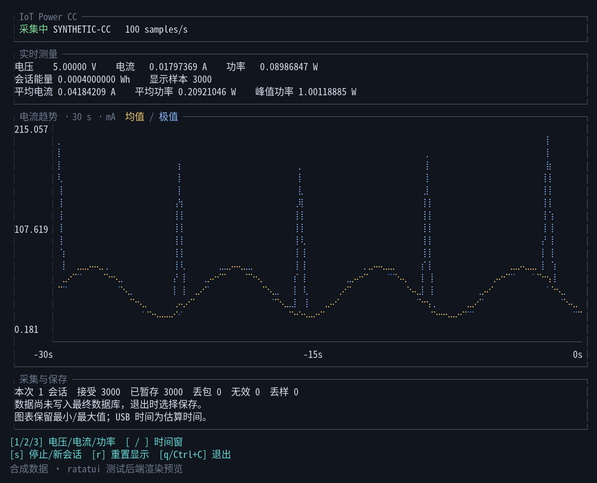
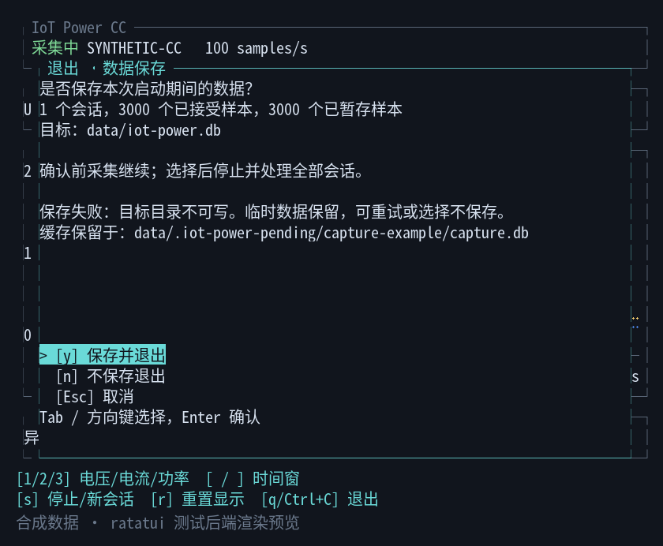

# IoT Power TUI

**用终端观察 IoT Power CC 的电压、电流与功率，支持本地采集与局域网远程查看。**

基于 Rust 和 ratatui 的 CC 上位机，支持原生 USB 数据采集、实时趋势图及 SQLite 存储。无需厂商 SDK DLL，也可以使用模拟数据体验界面。



*界面图片由合成数据通过 ratatui 测试后端渲染，不包含真实设备采集数据。终端字体和配色可能影响实际显示效果。*

## 功能

- **原生 CC USB 接入**：自动读取设备校准，支持按序列号选择设备。
- **实时趋势图**：切换电压、电流、功率，查看最近 10、30 或 60 秒的数据。
- **保留尖峰**：同时展示平均趋势与最小/最大值包络，自动缩放纵轴和单位。
- **明确的数据去留**：采集时暂存，退出选择保存、不保存或取消；支持一次启动中的多个采集会话。
- **可追溯的采集记录**：保存校准信息、原始帧、样本与包序号，记录丢包及会话完整性。
- **Service / Client**：服务端持续入库，多客户端 TUI 实时查看，可下载当前或历史会话 SQLite。
- **无需设备也能开发**：提供 mock、JSONL 回放和串口 JSONL 输入。

> CC 使用原生 USB bulk（VID `1209` / PID `7301`），不会作为普通串口连接。`--port` 仅适用于自行提供的串口 JSONL 数据源。

## 快速开始

### 环境要求

- Rust stable 工具链，建议使用当前稳定版本。
- C 编译器、make、pkg-config；SQLite 和 libusb 使用 bundled/vendored 源码构建。
- UTF-8 终端及支持中文、Braille 字符的字体。建议至少 **100 列 × 30 行**；最小布局为 48 列 × 16 行。

获取源码后，在仓库根目录运行：

```bash
# 无需硬件，先体验界面
cargo run -- --mock

# 编译优化版本
cargo build --release --locked

# 列出 CC 设备及其序列号
./target/release/iot-power-tui --list-devices

# 连接 CC；Linux 用户请先完成下方 USB 权限配置
./target/release/iot-power-tui --usb
```

多个 CC 同时连接时，必须通过序列号选择：

```bash
./target/release/iot-power-tui --usb --device '<SERIAL>' --db ./data/capture.db
```

本地 TUI 要求显式选择且只选择一个数据源。`--db` 的默认值为 `./data/iot-power.db`，它是**最终保存目标**，只有确认保存后才写入。

## Service / Client 模式

在连接 CC 的主机上运行服务，无终端界面，默认监听 `0.0.0.0:8080`：

```bash
./target/release/iot-power-tui --service
./target/release/iot-power-tui --service --addr 0.0.0.0:8080 --db ./data/service.db
./target/release/iot-power-tui --service --device '<SERIAL>'
# 无设备开发
./target/release/iot-power-tui --service --mock
```

在同一局域网内启动客户端；省略地址时连接 `127.0.0.1:8080`：

```bash
./target/release/iot-power-tui --client --addr 192.168.1.10:8080
./target/release/iot-power-tui --client --addr 192.168.1.10:8080 --download-dir ./downloads
```

服务端**直接写入 `--db`**（默认 `./data/iot-power.db`），不使用退出暂存确认。详细样本留在服务端；客户端每约 200 ms 拉取统计与最多 60 秒图表桶，不拉取整个数据库。支持多个只读客户端，网络断开时保留最后图表并显示离线，恢复后自动刷新。

| 客户端按键 | 操作 |
| --- | --- |
| `1` / `2` / `3`、`[` / `]` | 与本地模式一致，切换指标和窗口 |
| `h` | 打开/关闭服务端当前及历史会话列表 |
| `↑` / `↓`、`PgDn`、`r` | 选择会话、下一页、返回最新页 |
| `d` | 下载选中会话；实时界面下载当前会话 |
| `r`（实时界面） | 立即刷新；不重置服务端统计 |
| `Esc` | 关闭会话列表 |
| `q` / `Ctrl+C` | 退出客户端，不停止服务、不询问保存 |

下载包含选定会话、校准、原始帧和全部已提交样本。进行中的会话下载为一致性部分快照，`export_metadata.partial=1`，不会停止采集或将会话标为完成。文件先写 `.part`，校验后生成唯一 `.db`，不覆盖旧文件；客户端退出会取消下载并清理未完成文件。服务端同时只允许一个导出/下载，忙时可稍后重试。

USB 故障后服务端结束旧会话，按 2、4、8、16、30 秒退避重连，重新读取校准并创建新会话。写入故障停止采集并显示错误，修复后需重启服务；回放结束后 HTTP 仍可查询。Ctrl+C / SIGTERM 会排空已接受数据并关闭服务。历史会话不会自动删除。

本期用于**可信局域网**，不带认证、TLS 或远程设备控制。`--addr` 接受 IP:端口（IPv6 使用 `[::1]:8080`）；仅用于 service/client。客户端不接受 `--db` 或本地数据源。API 字段和下载语义见 [Service API](docs/service-api.md)。

### Linux USB 权限

桌面登录用户可安装仅匹配 CC 的 udev 规则：

```bash
sudo tee /etc/udev/rules.d/70-iot-power-cc.rules >/dev/null <<'RULE'
SUBSYSTEM=="usb", ENV{DEVTYPE}=="usb_device", ATTR{idVendor}=="1209", ATTR{idProduct}=="7301", TAG+="uaccess"
RULE
sudo udevadm control --reload-rules
```

重新插拔 CC，再执行 `--list-devices`。如果仍提示 `Access denied`，检查设备节点的读写权限；无桌面登录的服务器应由管理员配置专用设备组。临时 ACL 会在重新插拔后失效。

无需以 root 运行采集程序。`dialout` 组用于串口输入，不解决 CC 原生 USB 的访问权限问题。

## 使用界面

| 按键 | 操作 |
| --- | --- |
| `1` / `2` / `3` | 切换电压 / 电流 / 功率；默认电流 |
| `[` / `]` | 切换 10、30、60 秒窗口；默认 30 秒 |
| `s` | 停止采集并暂存剩余数据；再次按下创建新会话 |
| `r` | 重置显示统计和图表历史，不重置会话能量或采集计数 |
| `q` / `Ctrl+C` | 打开退出保存弹窗 |

图表以黄色显示平均值、蓝色显示极值。每 100 ms 逐样本汇总，再根据图表宽度合并显示，保留最多 60 秒 / 600 个分段时间桶。纵轴统一使用 V/mV、A/mA/µA 或 W/mW/µW。

显示分组固定在测量时间轴上：指标、时间窗和终端宽度不变时，已完成区段的均值和极值保持不变，只随时间向左平移；最右侧尚在采集的区段继续更新。移出窗口的分组整体移除。调整终端宽度或时间窗会重新聚合，纵轴仍根据可见数值自动缩放。

缺包与缺失时间桶会断开曲线；时间倒退或新会话会重新建立可见历史。图表用于观察趋势和尖峰范围，并非逐点显示全部原始波形。

### 保存、不保存与取消

退出弹窗的选择作用于**本次程序启动创建的全部会话**，包括使用 `s` 停止后重新开始的会话。

| 选择 | 行为 |
| --- | --- |
| 保存并退出 | 停止采集、排空队列，通过单一事务合并到目标数据库，保留已有历史数据 |
| 不保存退出 | 停止采集，只清理本次运行的临时目录 |
| 取消 | 关闭弹窗，继续采集 |

使用上下/左右方向键或 Tab 选择、Enter 确认；也可直接按 `y` 保存、`n` 不保存、Esc 取消。默认选中保存。弹窗内再次按 `q` 或 Ctrl+C 只取消弹窗；等待选择时采集仍会继续。没有产生样本时直接退出。

<details>
<summary>查看退出弹窗与保存失败提示</summary>



</details>

保存与清理在后台执行，界面显示阶段和样本进度。保存失败会回滚目标事务、保留缓存，允许重试；提交成功后的缓存清理失败只报告残留位置，不重复导入。

## 数据存储与完整性

本地 TUI 采集期间，数据写入目标数据库父目录下的 `.iot-power-pending/capture-随机标识/capture.db`。“已暂存”表示已提交临时 SQLite，不表示已写入最终数据库。异常退出遗留的缓存不会自动删除；当前尚无缓存恢复浏览器，请保留提示中的路径。

| SQLite 表 | 内容 |
| --- | --- |
| `sessions` | 设备序列号、校准原帧、会话时间、采集计数及完整性状态 |
| `frames` | 原始测量帧、包序号、主机接收时间和异常计数 |
| `measurements` | 测量值、时间、能量、关联帧及包内样本索引 |

原始 USB 帧只存储一次，样本通过 `frame_id` 和 `sample_index` 关联。保存时自动迁移旧 MVP 数据结构，不删除旧测量数据。

CC 每包包含 800 个样本，名义采样率为 10 kHz。采集、数据库写入与约 10 Hz 的 UI 刷新独立运行；队列最多 32 包，每 4 包或 250 ms 提交临时事务。

USB 样本时间为**估算时间**：以首包接收 UTC 为基准，根据包序号和 100 µs 间隔推算。缺包保留时间空隙，不补样，也不跨缺口积分；能量仅累加有效样本的 `power_w × 0.0001 / 3600`，单位为 Wh。

USB 断开、超时、无效样本、队列溢出或写入失败会显式报错。故障后已有数据仍可选择保存，受影响会话标记为 `incomplete`，程序退出返回非零状态。强制结束进程或断电可能丢失尚未提交的数据。

完整字段定义、校准公式、合成示例和证据来源见 [CC 数据帧协议](docs/cc-protocol.md)。

## 其他数据源

```bash
cargo run -- --replay samples.jsonl
cargo run -- --port /dev/ttyACM0 --baud 115200
```

JSONL 每行一个测量对象，以下是合成示例：

```json
{"timestamp":"2026-01-01T00:00:00Z","device_id":"synthetic","voltage_v":5.0,"current_a":0.1,"power_w":0.5,"energy_wh":0.0,"status":"example","raw":[]}
```

单行上限 1 MiB。回放按照存储能力读取，不模拟原始时间间隔。字段定义见 [Measurement](src/domain.rs)。

## Tag 自动构建与发布

推送新 tag 后，GitHub Actions 的 `Release binaries` 工作流会构建并测试以下版本，全部成功后创建 GitHub Release：

| 平台 | 架构 / Rust target | 构建 runner |
| --- | --- | --- |
| Linux | x86_64 / `x86_64-unknown-linux-gnu` | Ubuntu 22.04 x86_64 |
| Linux | ARM64 / `aarch64-unknown-linux-gnu` | Ubuntu 22.04 ARM64 |
| macOS | Intel / `x86_64-apple-darwin` | macOS 15 Intel |
| macOS | Apple Silicon / `aarch64-apple-darwin` | macOS 15 ARM64 |

```bash
# 先将包含工作流的代码提交并推送到 GitHub；然后创建并推送版本 tag
# 将 v0.2.0 替换为本次版本号
git tag -a v0.2.0 -m "Release v0.2.0"
git push origin v0.2.0
```

任何 tag 名都能触发，推荐 `v版本号`。工作流固定使用 Rust 1.93.1 和 `Cargo.lock`；每个原生 runner 执行 fmt、check、test、Clippy、release 编译及 `--help` 验证。ARM64 runner 适用于本项目的 GitHub 公共仓库。

Release 附件包含四个 `iot-power-tui-<tag>-<target>.tar.gz` 和一个 `SHA256SUMS`。压缩包内含可执行文件、MIT 许可证、README 与协议/API 文档。Linux 版本要求 glibc 2.35 或更新版本及 `libudev.so.1`（例如 Ubuntu 22.04+）；macOS 部署目标为 11.0，产物未做 Apple 签名或公证。

下载对应架构的压缩包后，可用 `sha256sum --ignore-missing -c SHA256SUMS`（Linux）校验，再解压执行包内的 `./iot-power-tui --help`。macOS 可用 `shasum -a 256 <压缩包>` 与校验文件比对。

工作流只在发布 job 中授予 `contents: write`，使用内置 `GITHUB_TOKEN`，无需额外 secret。失败时可在 Actions 中重新运行该 tag 的工作流；上传完成前保留 draft，重跑会补齐并覆盖同名附件。tag 构建定义见 [release.yml](.github/workflows/release.yml)。

## 开发与贡献

欢迎提交问题报告、协议证据、测试和改进。问题报告请附上操作系统、Rust 版本、设备/固件信息、复现步骤及错误提示；避免公开敏感采集记录。

```bash
cargo check --locked
cargo test --locked
cargo fmt -- --check
cargo clippy --locked --all-targets -- -D warnings
cargo build --locked
python3 tests/tui_smoke.py  # Unix PTY 交互测试，需要 Python 3
python3 tests/service_smoke.py  # HTTP、多客户端与远程 TUI
python3 tests/service_transfer.py  # 大文件、下载互斥、取消与异常
```

格式与 lint 工具可通过 `rustup component add rustfmt clippy` 安装；使用系统发行版 Rust 时，请安装匹配版本的软件包。网络受限时按自己的环境设置 `HTTP_PROXY` / `HTTPS_PROXY`。

| 模块 | 职责 |
| --- | --- |
| `src/main.rs`、`src/ui.rs` | 应用循环、布局与交互 |
| `src/history.rs`、`src/domain.rs` | 图表聚合、测量值与统计 |
| `src/source/`、`src/protocol.rs` | 数据源、USB 帧解析与校准 |
| `src/network.rs`、`src/client.rs` | HTTP API、会话快照、客户端网络工作线程 |
| `src/runtime.rs` | 工作线程、队列和取消 |
| `src/storage.rs`、`src/workspace.rs` | SQLite、临时缓存和保存合并 |
| `tests/` | 终端交互测试 |

测试使用合成数据。提交应说明用户可见行为、验证结果和硬件假设；涉及界面变更时附预览，涉及协议或数据库变化时说明兼容性。贡献约定见 [AGENTS.md](AGENTS.md)。

请勿提交设备采集数据、凭据、运行数据库或构建产物。`data/`、`work/`、`outputs/`、`target/`、`downloads/` 和临时采集目录均已忽略。

## 当前状态与边界

项目处于 MVP 阶段，已验证 Linux x86_64；macOS 和 Windows 尚未完成构建及实机验证。

- Rust 测试覆盖协议、图表、持久化和会话快照；Unix PTY 测试覆盖本地保存流程与远程客户端。
- 新版 TUI 在 Linux 上完成约 66 秒 CC 实机采集：660,800 个样本，零丢包，暂存与最终入库计数一致，采集进程内存约 11.7–11.8 MB。
- Service/client 在双 TUI 客户端下完成约 66 秒 CC 实机观察：680,000 个样本、850 帧，零丢包/无效/丢样；活动会话下载与 SQLite 完整性校验通过，服务端 RSS 约 16–31 MiB。
- 上述实机测试为近零输入条件，不能替代真实负载下各量程的精度校验。
- 当前不提供输出电压/开关控制、固件刷写、历史波形查看、CSV 导出或完整示波器功能。

本项目只发送已验证的校准/状态查询，不修改 DUT 输出。

## 许可证

本项目采用 [MIT License](LICENSE)。
